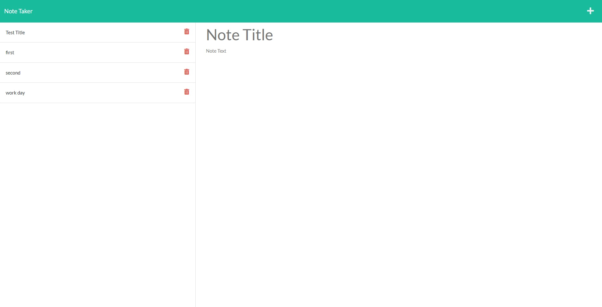

# Note Taker 

## description

With how busy everyone is these days it is extremely important to keep track
of your daily, weekly, and monthly to-dos. This is especially important for a business
owner in order to help them thrive. 

This app is a note taker that creates a database of previously saved notes for future 
veiwing, to help with stay organized and complete tasks on time!

## Table of Contents

* [Installation](#installation)
* [Usage](#usage)

## Installation

For this program, in order to run the app locally you will need node.js (on your computer), express.js, and uuidv4 installed into your directory. From there you should be able to run the app via command line. Aside from the the deployed heroku url should function perfectly fine without any other programs needed.

## Usage

This app is used to take and save notes for future use. As seen below you first name your note, then fill in the details in the space below. Once finished you hit the save icon on the top left and the note will be saved on the left side of your screen. If you want to create a new note, hit the plus sign at the top right and a fresh window will appear in the middle of your screen. If you want to veiw a old note you can click any note that appears on the left side of your screen and it will populate in the middle of your screen.

Image of the deployed app 
